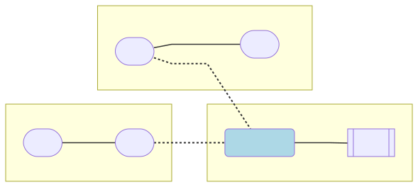
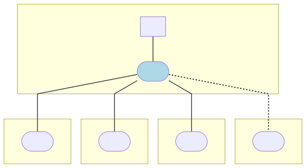

# TCA9548

A simple, but effective, solution for I²C bus managment.

This package allows for direct and simple interaction with the channel (segment) selection API.  It also provides a `I2CBus` implementation for creating an abstraction layer for compositing multi-bus multi-sensor deployments.


[Adafruit](https://learn.adafruit.com/adafruit-tca9548a-1-to-8-i2c-multiplexer-breakout?view=all) as always.

[](https://www.npmjs.com/package/@johntalton/tca9548)


[](https://www.npmjs.com/package/@johntalton/tca9548)

[](https://packagequality.com/#?package=@johntalton/tca9548)


## API

The main interface and factory class is `Tca9548`.  It provides the factory method `from` which is passed a valid I2CBus.

Channel number for this 8-Channel device is 0 - 7

##### `getChannels`
Queries the device and returns and array of enabled channels. If not channels are enabled then the empt array is returned.

##### `setChannels`
Sets the devices active channels.  Takes in an array of channels


#### Example:

```js
const i2c = require('i2c-bus');
const { Tca9548 } = require('@johntalton/tca9548');

// setup device
const i2c1 = await provider.openPromisified(1);
const device = await Tca9548.from(new I2CAddressedBus(i2c1, 0x70));
const channels = await device.getChannels();

// deconstruct and append channel three
await device.setChannels([...channels, 3]);

```


### Additional API
This package also provids an abstraction layer around Channel Managment and the devices in ordre to expose a `I2CTcaBus` implementation.  This serves as a compliant `I2CBus` allowing for other Chip / Sensor implementations to abstract Bus Managment and Sensor specific code.

```js
// ...
const i2c = // any comliant implementation like require('i2c-bus')
const virtualI2cX = await TcsBus.from(...);

const sensor = await SomeSensor.init(new I2CAddressedBus(virtualI2cX, sensorAddress));
```


## Concept
The TCA provides a managment layer that exposes channels. Each channel is an I²C bus segment that can extends the host I²C bus. The managment layer allow for forking and joining these channels.

As such, zero or more channel can extend the host bus.  Allowing for the host bus to address directly all connected devices to the unified channels.


### Consider the following
Assume four sensor are connected to the TCA chip via channel 0 and 1, and each sensor label by it's address.



Using the above bus configuration, the following commands will describe and allow you to control the bus segments.
```
> node tune off
> i2cdetect
  0x10 0x70
> node tune 0
> i2cdetect
  0x1 0x2 0x10 0x70
> node tune 1
> i2cdetect
  0x3 0x4 0x10 0x70
> node tune 0 1
> i2cdetect
  0x1 0x2 0x3 0x4 0x10 0x70
```

Make note of the last multi channel `tune` call.
Also the fact that `0x10` and `0x70` is always present from the host perspective as expected.

### Overlapping static address multiplexing
A simple / common use case is to use the TCA to select from sensor that would nomraly share an address (and create errors on the I²C bus) by placing each on individual channels:



In such a configuration the `tune` command would exclusivly select each channel (never selecting more then one at a time), and the `i2cdetect` call would always return 0xA onto the host bus.

Some care is needed by calling application layer when managing and caching resourses as called from code addressing 0xA (in this example) will result in read/write on different sensors depending on the channel configuration.


## Interoperability / Dependencies
This project aims to provide a common / abstract I²C bus implementation such that transparent sensor logic can be writen without knowledge of the bus layer.

Wrapper code for `i2c-bus` and `onoff` are well supported.
